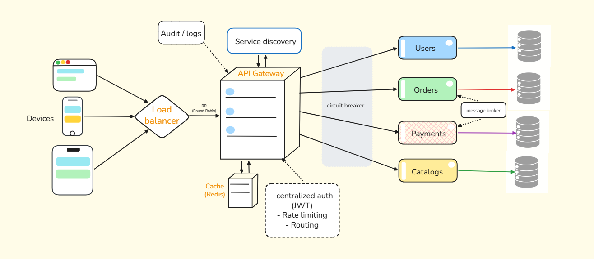

# Microservices architecture — Node, Express, MySQL & Docker

## Overview
This project implements a microservices architecture using Docker, Express, and MySQL, orchestrated through Docker Compose. It consists of an Nginx load balancer, an API Gateway handling centralized authentication (JWT), rate limiting, and request routing, and four independent microservices (Users, Orders, Payments, Catalogs), each with its own dedicated MySQL database to ensure loose coupling. Redis is used as a caching layer to improve gateway performance, RabbitMQ enables asynchronous communication between services (notably Orders and Payments), and a circuit breaker pattern (via Opossum) protects the system from cascading failures. The architecture is designed to be scalable, fault-tolerant, and production-ready, following separation of concerns and service independence principles.

## Challenge
Design and implement a scalable microservices architecture for an e-commerce-style system, based on the diagram below. The system routes client requests through a load balancer and API Gateway (handling centralized JWT authentication, rate limiting, and routing), distributes traffic to four independent microservices (Users, Orders, Payments, Catalogs) each backed by its own MySQL database, uses Redis for caching, RabbitMQ for asynchronous inter-service communication, and a circuit breaker pattern to prevent cascading failures.

